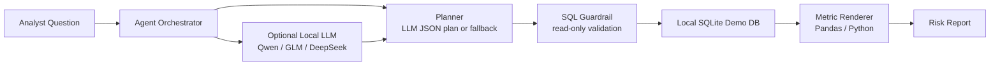

# FinRisk Agent CN Demo

> A public demo of a local, closed-environment financial risk analysis agent for consumer credit scenarios.

本项目是一个 **公开展示用 demo**。项目不包含任何真实业务数据、客户信息、内部策略或生产模型，所有数据均由脚本合成生成。它展示的是：在金融机构常见的封闭数据环境中，如何用本地国产开源模型、本地数据库和受控工具调用，完成一条可审计的风险分析 Agent 工作流。

## Demo Overview

FinRisk Agent CN Demo 面向消费金融与信贷风控分析场景。用户输入自然语言问题后，Agent 会完成：

1. 理解分析任务与指标口径
2. 生成只读 SQL 分析计划
3. 通过 SQL guardrail 校验查询安全性
4. 在本地 SQLite 数据库执行分析
5. 对关键指标进行程序侧整理与校验
6. 输出风险发现、异常客群和建议动作

核心能力覆盖：

- 资产质量分析：M1/M2 逾期率、余额、风险等级、渠道和产品拆解
- 策略评估：策略调整前后通过率、放款率、逾期率和净收入对比
- 风险日报：按渠道和风险等级生成月度风险摘要
- 封闭环境适配：支持本地 OpenAI-compatible LLM endpoint，也支持无模型 fallback demo 模式

## Demo Scenarios

| Scenario | User Question | Agent Output |
| --- | --- | --- |
| Delinquency trend | 分析近6个月M1/M2逾期率变化，并定位主要风险上升客群 | 分组 SQL、MOB3 M1/M2 趋势、高风险渠道/等级/产品组合、建议动作 |
| Strategy impact | 评估2025年7月额度策略调整前后的通过率、M1逾期率和收益变化 | 策略前后申请量、通过率、放款率、MOB3 M1、余额和净收入 |
| Risk daily report | 生成最近一个月风险日报，说明核心指标、异常波动和建议动作 | 最近月份渠道/风险等级拆解、最高风险分组和监控建议 |

完整样例输出见 [docs/sample_outputs.md](docs/sample_outputs.md)。

## Closed-Environment Architecture



The demo is designed for private deployment:

- No external data access is required during analysis.
- The default mode can run without any LLM endpoint.
- Local LLMs can be served by Ollama, llama.cpp, vLLM, Xinference, or any OpenAI-compatible server.
- SQL execution is restricted to read-only statements.
- Demo data is generated locally and is fully synthetic.

## Synthetic Data Model

The generated demo database contains five tables:

| Table | Purpose |
| --- | --- |
| `customers` | Synthetic customer profile: age band, city tier, risk grade, income band |
| `applications` | Credit applications: date, channel, product, requested amount, approval result |
| `loans` | Booked loans: principal, tenor, rate |
| `monthly_performance` | MOB-level performance: balance, M1/M2 flags, interest income, credit loss |
| `strategy_events` | Demo strategy event metadata, including the July 2025 limit policy change |

The generator intentionally creates realistic-looking risk patterns such as channel quality differences, risk-grade gradients, and policy-period shifts. It does not recreate any real portfolio.

## Local Model Options

The project is model-agnostic and can call any local OpenAI-compatible endpoint. Recommended Chinese open-weight model families:

- `Qwen2.5-Coder-7B-Instruct` / `Qwen2.5-Coder-14B-Instruct`
- `Qwen3-8B` / `Qwen3-14B`
- `GLM-4-9B` / `GLM-Z1-9B`
- `DeepSeek-R1-Distill-Qwen-7B` / `DeepSeek-R1-Distill-Qwen-14B`

If no local model is available, set `llm.enabled: false` and the demo uses built-in planning templates so the end-to-end workflow remains runnable.

## Run The Demo

```bash
python -m venv .venv
source .venv/bin/activate
pip install -r requirements.txt

python scripts/generate_demo_data.py
streamlit run app.py
```

CLI mode:

```bash
python -m finrisk_agent.cli "分析近6个月M1/M2逾期率变化，并定位主要风险上升客群" --show-sql
```

See [docs/demo_walkthrough.md](docs/demo_walkthrough.md) for a complete reviewer-facing walkthrough.

## Local LLM Configuration

Copy the example config:

```bash
cp config.example.yaml config.yaml
```

Example for a local OpenAI-compatible endpoint:

```yaml
llm:
  enabled: true
  provider: local_openai_compatible
  base_url: http://localhost:11434/v1
  model: qwen2.5-coder:7b
  temperature: 0.1
  timeout_seconds: 60
```

## Repository Structure

```text
.
├── app.py                         # Streamlit demo UI
├── config.example.yaml            # Local model config example
├── data/                          # Generated synthetic demo data
├── docs/
│   ├── demo_walkthrough.md         # Reviewer-facing demo guide
│   └── sample_outputs.md           # Example SQL and generated reports
├── finrisk_agent/
│   ├── agent.py                    # Orchestration
│   ├── cli.py                      # CLI entrypoint
│   ├── llm.py                      # Local model client
│   ├── planner.py                  # JSON planning with fallback templates
│   ├── reporting.py                # Report rendering
│   └── sql_tools.py                # Read-only SQL execution and guardrails
├── scripts/generate_demo_data.py   # Synthetic credit dataset generator
└── tests/                          # Lightweight guardrail tests
```

## Safety And Scope

This repository is a public demo and portfolio project. It does not provide credit decisions, investment advice, regulatory advice, or production risk policy. All data is synthetic.
