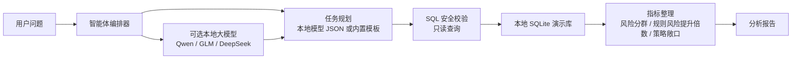

# 消费金融风控分析智能体演示项目

> 一个面向封闭环境的消费金融风控数据分析智能体公开演示项目。

本项目是公开展示用演示项目，不包含任何真实业务数据、客户信息、内部策略或生产模型。所有数据均由脚本合成生成，用于展示在金融机构常见的封闭数据环境中，如何用本地国产开源模型、本地数据库和受控工具调用，完成“风险分析、规则挖掘、策略开发、报告生成”的可审计工作流。

## 项目定位

消费金融风控分析通常具有指标口径复杂、数据链路长、策略结果需要可解释、数据不能出域等特点。本演示项目将智能体约束在本地环境中，让它围绕合成信贷数据完成以下任务：

1. 理解自然语言分析问题
2. 生成只读 SQL 分析计划
3. 校验 SQL 安全性
4. 在本地 SQLite 数据库执行分析
5. 挖掘高风险规则和候选策略
6. 输出风险发现、策略建议和可复核报告

## 核心功能

| 功能 | 说明 | 示例问题 |
| --- | --- | --- |
| 风险趋势分析 | 按月份、渠道、风险等级、产品类型分析 M1/M2 逾期趋势 | 分析近6个月M1/M2逾期率变化，并定位主要风险上升客群 |
| 风控规则挖掘 | 按渠道、风险等级、产品、城市等级、收入带挖掘高风险规则，并计算风险提升倍数 | 挖掘高风险风控规则，按风险提升倍数排序并给出候选规则 |
| 策略开发 | 生成准入收紧、额度下调、人工复核等候选策略，并评估命中量、风险和敞口 | 基于近期表现开发准入与额度策略候选方案，输出命中量、风险和建议动作 |
| 策略效果评估 | 对比策略调整前后的通过率、放款率、MOB3 M1、余额和净收入 | 评估2025年7月额度策略调整前后的通过率、M1逾期率和收益变化 |
| 风险日报 | 生成最近月份的渠道和风险等级拆解报告 | 生成最近一个月风险日报，说明核心指标、异常波动和建议动作 |

完整演示输出见 [docs/sample_outputs.md](docs/sample_outputs.md)。

## 封闭环境架构



封闭环境设计要点：

- 分析过程不依赖外部数据访问。
- 默认模式不要求模型服务，可以用内置模板跑通完整演示。
- 如果配置本地模型，可接入 Ollama、llama.cpp、vLLM、Xinference 或任意兼容 OpenAI 接口的本地服务。
- SQL 执行前会做只读校验，阻断写入、删除、建表等操作。
- 数据由本地脚本生成，完全合成，不复刻任何真实资产组合。

## 合成数据模型

演示数据库包含五张表：

| 表名 | 用途 |
| --- | --- |
| `customers` | 合成客户画像，包括年龄段、城市等级、风险等级、收入带 |
| `applications` | 信贷申请信息，包括申请日期、渠道、产品、申请金额、审批结果 |
| `loans` | 放款信息，包括本金、期限、利率 |
| `monthly_performance` | MOB 表现，包括余额、M1/M2 标记、利息收入、信用损失 |
| `strategy_events` | 策略事件说明，例如 2025 年 7 月额度策略调整 |

数据生成逻辑保留了渠道质量差异、风险等级梯度、大额低收入风险、策略调整前后变化等特征，用于演示风控规则挖掘和策略开发流程。

## 本地模型适配

项目不绑定具体模型，只要求本地服务兼容 OpenAI Chat Completions 接口。适合在封闭环境中演示的国产开源模型包括：

- `Qwen2.5-Coder-7B-Instruct` / `Qwen2.5-Coder-14B-Instruct`
- `Qwen3-8B` / `Qwen3-14B`
- `GLM-4-9B` / `GLM-Z1-9B`
- `DeepSeek-R1-Distill-Qwen-7B` / `DeepSeek-R1-Distill-Qwen-14B`

没有本地模型时，将 `llm.enabled` 设置为 `false`，演示项目会使用内置规划模板。

## 运行方式

```bash
python -m venv .venv
source .venv/bin/activate
pip install -r requirements.txt

python scripts/generate_demo_data.py
streamlit run app.py
```

命令行模式：

```bash
python -m finrisk_agent.cli "挖掘高风险风控规则，按风险提升倍数排序并给出候选规则" --show-sql
```

完整演示流程见 [docs/demo_walkthrough.md](docs/demo_walkthrough.md)。

## 本地模型配置

复制配置样例：

```bash
cp config.example.yaml config.yaml
```

本地兼容 OpenAI 接口服务配置示例：

```yaml
llm:
  enabled: true
  provider: local_openai_compatible
  base_url: http://localhost:11434/v1
  model: qwen2.5-coder:7b
  temperature: 0.1
  timeout_seconds: 60
```

## 项目结构

```text
.
├── app.py                         # 中文演示页面
├── config.example.yaml            # 本地模型配置样例
├── data/                          # 本地生成的合成演示数据
├── docs/
│   ├── demo_walkthrough.md         # 中文演示流程
│   └── sample_outputs.md           # 样例 SQL 与报告输出
├── finrisk_agent/
│   ├── agent.py                    # 智能体编排
│   ├── cli.py                      # 命令行入口
│   ├── llm.py                      # 本地模型客户端
│   ├── planner.py                  # 任务规划与内置模板
│   ├── reporting.py                # 报告生成
│   └── sql_tools.py                # 只读 SQL 执行与安全校验
├── scripts/generate_demo_data.py   # 合成信贷数据生成脚本
└── tests/                          # SQL 安全校验测试
```

## 安全边界

本项目仅用于公开演示和作品集展示，不提供授信决策、投资建议、监管建议或生产风控策略。所有数据均为合成数据，所有规则和策略仅用于说明方法。
