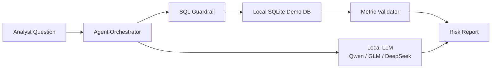

# FinRisk Agent CN Demo

> Demo project: a local, closed-environment financial risk analysis agent for consumer credit scenarios.

本项目是一个 **公开 GitHub 展示用 demo**，不包含任何真实业务数据、客户信息或公司内部规则。项目使用合成信贷数据，演示如何在封闭环境中基于国产开源大模型、本地数据库和受控工具调用完成金融风险数据分析。

## What It Does

FinRisk Agent CN Demo 面向消费金融与信贷风控场景，支持用自然语言发起分析任务，并在本地完成：

- 风险指标分析：通过率、放款率、M1/M2 逾期率、余额、收益等
- SQL 生成与受控执行：只允许读取 demo 数据库中的白名单表
- 指标校验：程序侧重新计算关键指标，降低模型幻觉风险
- 异常归因：按渠道、产品、风险等级、额度段等维度拆解
- 报告生成：输出可读的风险分析摘要和建议动作

## Closed-Environment Design



The project is designed for private deployment:

- No external data access is required during analysis.
- The local LLM endpoint can be provided by Ollama, llama.cpp, vLLM, Xinference, or any OpenAI-compatible server.
- SQL is validated before execution and restricted to read-only statements.
- Demo data is generated locally and is fully synthetic.

## Recommended Local Models

The demo works best with Chinese open-weight models that are practical in closed environments:

- `Qwen2.5-Coder-7B-Instruct` or `Qwen2.5-Coder-14B-Instruct`
- `Qwen3-8B` / `Qwen3-14B`
- `GLM-4-9B` / `GLM-Z1-9B`
- `DeepSeek-R1-Distill-Qwen-7B` / `14B`

The code also includes a deterministic fallback planner, so the demo can run without a model endpoint.

## Quick Start

```bash
python -m venv .venv
source .venv/bin/activate
pip install -r requirements.txt

python scripts/generate_demo_data.py
python -m finrisk_agent.cli "分析近6个月M1/M2逾期率变化，并定位主要风险上升客群"
```

Optional Streamlit UI:

```bash
streamlit run app.py
```

## Local Model Configuration

Copy the example config and update the endpoint/model name:

```bash
cp config.example.yaml config.yaml
```

Example for an Ollama-compatible endpoint:

```yaml
llm:
  enabled: true
  provider: local_openai_compatible
  base_url: http://localhost:11434/v1
  model: qwen2.5-coder:7b
  temperature: 0.1
  timeout_seconds: 60
```

If `llm.enabled` is `false`, the demo uses built-in planning templates.

## Example Questions

```text
分析近6个月M1/M2逾期率变化，并定位主要风险上升客群
评估2025年7月额度策略调整前后的通过率、M1逾期率和收益变化
生成最近一个月风险日报，说明核心指标、异常波动和建议动作
对比不同渠道和风险等级的资产质量表现
```

## Repository Structure

```text
.
├── app.py                         # Streamlit demo UI
├── config.example.yaml            # Local model config example
├── data/                          # Generated synthetic demo data
├── finrisk_agent/
│   ├── agent.py                    # Orchestration
│   ├── cli.py                      # CLI entrypoint
│   ├── llm.py                      # Local model client
│   ├── planner.py                  # JSON planning with fallback templates
│   ├── reporting.py                # Report rendering
│   └── sql_tools.py                # Read-only SQL execution and guardrails
├── scripts/generate_demo_data.py   # Synthetic credit dataset generator
└── tests/                          # Lightweight unit tests
```

## Hackathon Submission Copy

一句话描述：

> 我构建了一个支持封闭环境部署的消费金融风险分析 Agent，使用 Qwen/GLM/DeepSeek 等国产开源模型、SQLite/Pandas 和本地工具调用，实现风险指标分析、SQL 执行、异常归因与报告生成。

项目角色和贡献：

> 我负责项目的金融风险场景设计、指标体系抽象、模拟信贷数据建模、本地 Agent 架构设计和核心分析流程实现，重点验证国产开源模型在封闭金融数据环境中的可控分析能力。

## Disclaimer

This repository is a demo for hackathon and portfolio purposes. It does not provide credit decisions, investment advice, regulatory advice, or production risk policy. All data is synthetic.
